# Interfaz de usuario (UI) para Modelo de Diagnóstico de Covid-19 Mediante el Análisis de Radiografías Pulmonares empleando Redes Neuronales Convolucionales (CNN)”
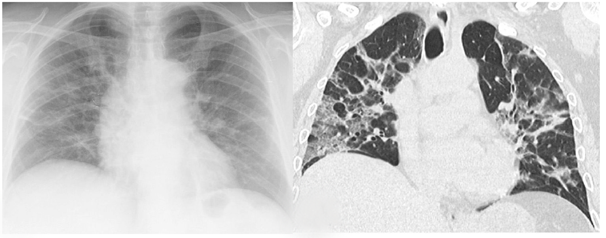
Interfaz de usuario para facilitar el uso del Modelo basado en la Arquitectura VGG-16 que emplea redes neuronales convolucionales para el diagnóstico de Covid-19 a 
partir del análisis de radiografías pulmonares 
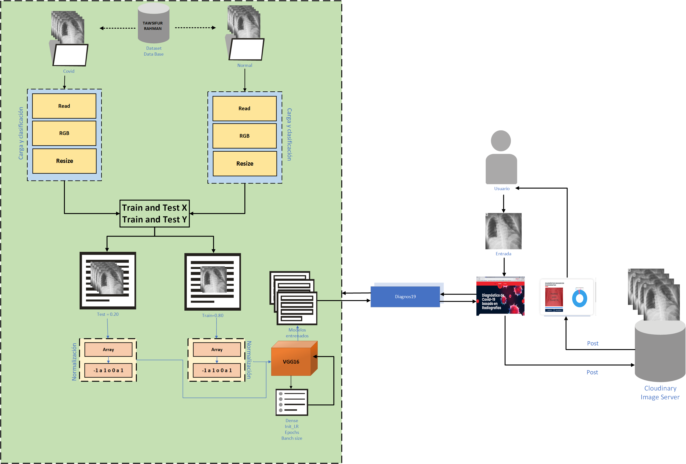
## Comenzando 🚀

Esta Interfaz Gr**á**fica de Usuario (GUI), fue construida para facilitar el uso del modelo [DiagnosVGG16Model](https://github.com/jr-98/DiagnosVGG16Model)
que a su vez, es el resultado del Trabajo de Titulación, denominado “Diagnóstico de Covid-19 Mediante el Análisis 
de Radiografías Pulmonares Empleando un Modelo Basado en Redes Neuronales Convolucionales (CNN)”, el cual hace referencia 
a este repositorio.  
Este es el segundo repositorio, contiene la GUI del modelo, al igual que todos los modelos entrenados (resultados del
repositorio 1) con sus respectivos pesos, complementando así la funcionalidad del sistema. Esta interfaz ha sido basada 
en una plantilla de open source, misma que ha sudo adaptada para permitir el uso del modelo seleccionado y posterior 
diagnóstico de la radiografía que el usuario ingrese.


### Pre-requisitos 📋
* Modelo [DiagnosVGG16Model](https://github.com/jr-98/DiagnosVGG16Model) levantado y escuchando en un puerto diferente 
al 8000
### Componentes de Hardware utilizados
* Inter (R) Core(TM) i7-10750H
* Nvidia GeForce 2070 Super con 8 GB de NVRAM
* 32 GB de RAM
* Windows 10 Enterprise de 64-bits

### Preparación del ED
Como entorno de desarrollo (ED) se optó por el uso de PyCharm y como Framework de desarrollo se usó Django.


 ## Despliegue de la Interfaz  📦
Para levantar la GUI, utilizar el siguiente comando:
```buildoutcfg
python manage.py runserver
```
**Nota**: Para usar este comando, asegurarse de estar a la altura del directorio en el que se encuentra ```manage.py```
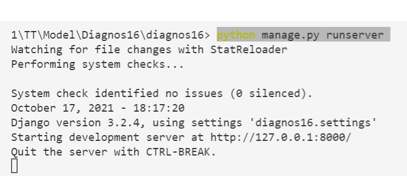
## Guía del sitio web 
Para la implementación y construcción de la GUI (Graphic User Interface), Interfaz gráfica de Usuario, se ha partido de una
plantilla HTML, CSS y JS de acceso libre bajo la licencia Creative Commons 3.0 (para uso gratuito tanto personal y 
comercial) llamada Covido, cuyo sitio web official se encuentra en el siguiente recurso
[html Desing](https://html.design/download/covido-free-coronavirus-html-template/).

Esta plantilla ha sido modificada y adaptada con a un Framework de alto nivel llamado Django, el 
cual permite el desarrollo rápido de sitios web, seguros y mantenibles. Además, Django es un framework gratuito y de 
código abierto, por lo que se acoge a las características de la mayoría de las herramientas utilizadas en el presente TT.
La estructura general del sitio se encuentra distribuido de la siguiente manera

* La sección de home se muestra en la siguiente imagen adjunta:
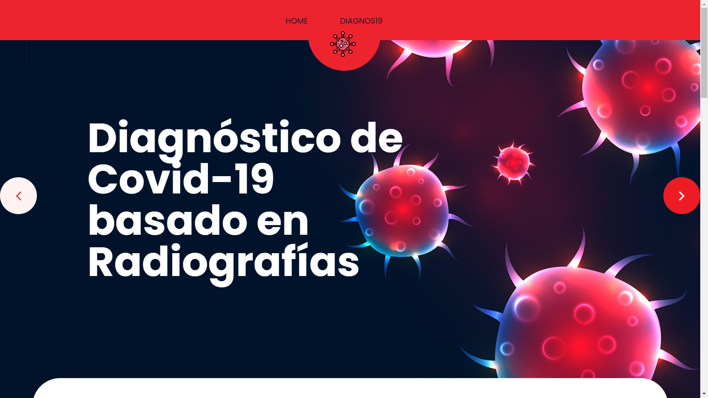
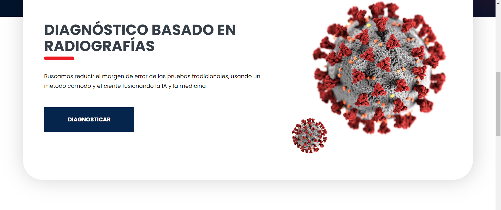

* La sección de casos de covid: 
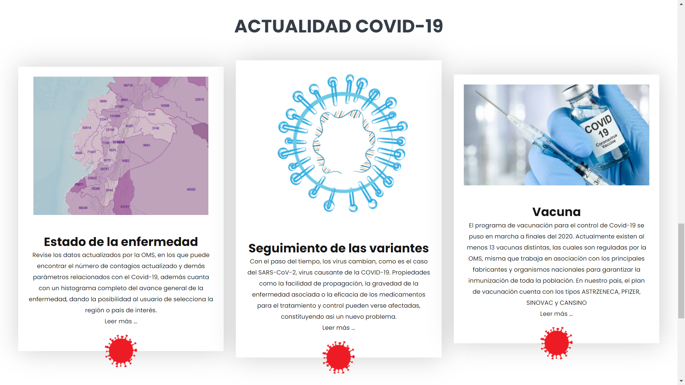
* La sección de contacto:
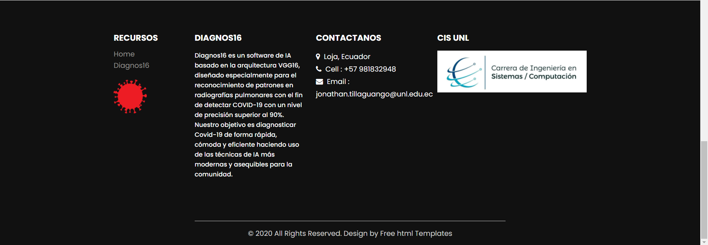
* La sección de Diagnos19
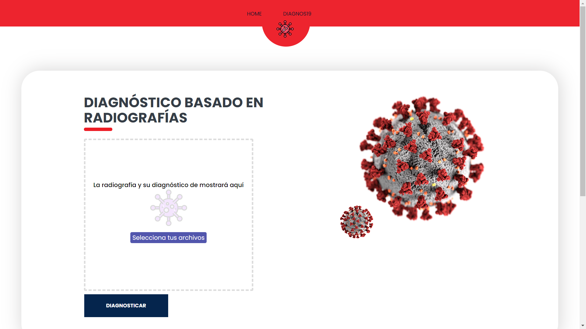
* Diagnosticar
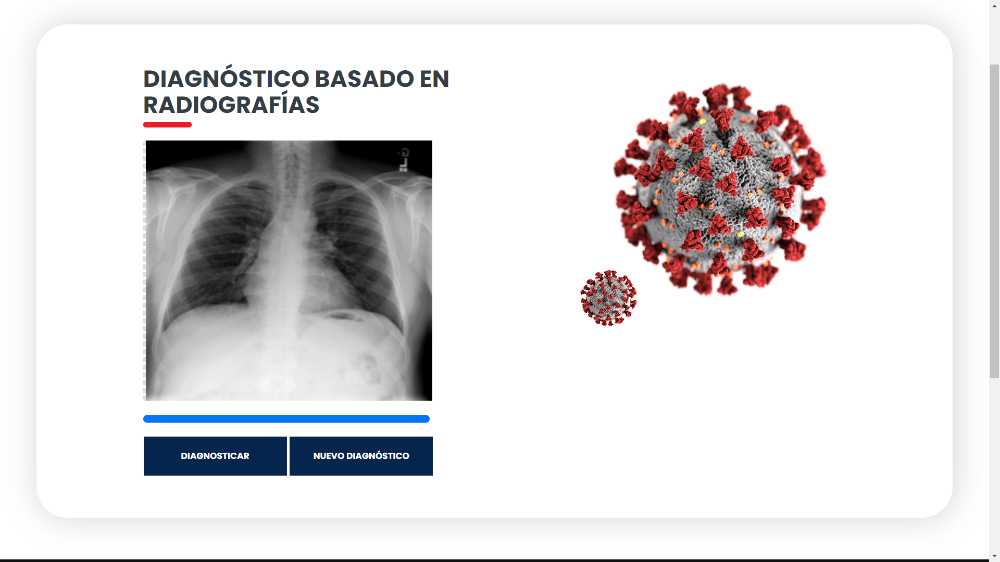
  * Diagnósticos Positivo para Covid-19
  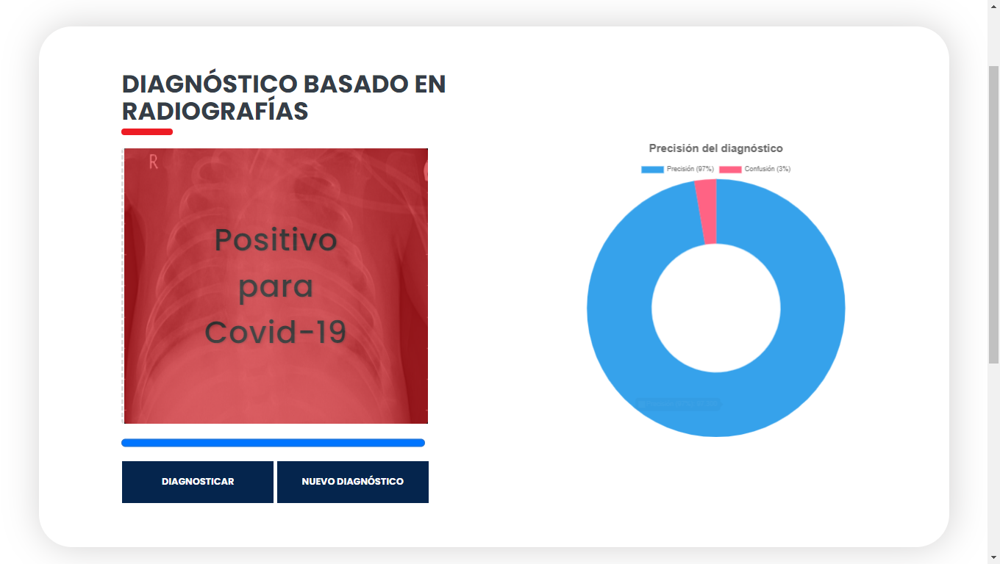
  * Diagnósticos Negativo para Covid-19
  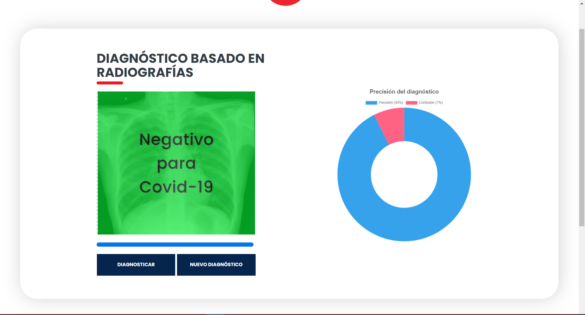
* Cloudinary


## Construido con 🛠️

_Menciona las herramientas que utilizaste para crear tu proyecto_
* [Python](https://www.python.org/) - Lenguaje de programación de alto nivel, utilizado para el desarrollo de modelo de 
IA debido a la gran cantidad de librerías, documentación y soporte.  
* [TensorFlow](https://www.tensorflow.org/) - Librería Open Source, utilizada para el desarrollo y entrenamiento de 
modelos de ML. 
* [Django](https://www.djangoproject.com/) - Framework Open Source basado en Python, para la construcción rápida y eficiente de 
aplicaciones y servicios web.  
* [FastApi](https://fastapi.tiangolo.com/) - Usado para generar generar y desplegar la API que permite la utilización 
del modelo
* [Github](https://github.com/)- Repositorio usado para el alojar el código y material concerniente al presente TT.

⌨ [jr-98](https://github.com/jr-98)