# Modelo para el diagnóstico de Covid-19 Mediante el Análisis de Radiografías Pulmonares empleando Redes Neuronales Convolucionales (CNN)”

Modelo basado en la Arquitectura VGG-16 que emplea redes neuronales convolucionales para el diagnóstico de Covid-19 a 
partir del análisis de radiografías pulmonares 

## Comenzando 🚀

Estas instrucciones son el complemento al Trabajo de Titulación, denominado “Diagnóstico de Covid-19 Mediante el Análisis 
de Radiografías Pulmonares Empleando un Modelo Basado en Redes Neuronales Convolucionales (CNN)”, el cual hace referencia 
a este repositorio. Estas instrucciones y su descripción, son el resultado de un largo proceso de desarrollo por lo que
solo se ha descrito las partes más relevantes del mismo, de tal forma que permitan al usuario/stakeholder, obtener una 
mejor perspectiva de lo que se hizo durante el transcurso del presente TT. 
Este es el primero de dos repositorios, los cuales completan la funcionalidad del sistema. En este primer repositorio
contiene el backend del modelo (código y API), además de los archivos utilizados en Jupyter pare el entrenamiento y 
creación de cada uno de los modelos que fueron entrenados acorde a la carga establecida, lo mismo que se encuentran en 
la carpeta Models de este mismo repositorio, así como el script que hace uso de los modelos entrenados y script 
concerniente a la creación de la API.

Mira **Deployment** para conocer como desplegar el proyecto.


### Pre-requisitos 📋
Estas instrucciones están orientadas al desarrollo del modelo en un ambiente local usando tanto **JupyterLab** y **PyCharm** 
como IDE's de desarrollo, por lo que se recomienda cumplir con los requisitos que más adelante se describen para evitar 
problemas de rendimiento. Estos requisitos se deben considerar en caso de implementar el modelo en un ambiente de 
desarrollo local (como lo es en este caso), si el modelo en cuestión se desea implementar ambiente orientado a la 
computación en la nube como Azure o Google Colab, se recomienda leer la documentación de este tipo de servicios, pues 
suelen disponer de ciertas librerías y recursos que pueden ser utilizados sin necesidad de instalarlos.

### Componentes de Hardware utilizados
* Inter (R) Core(TM) i7-10750H
* Nvidia GeForce 2070 Super con 8 GB de NVRAM
* 32 GB de RAM
* Windows 10 Enterprise de 64-bits
### Preparación del ED
Como entorno de desarrollo (ED) se optó por usar JupyterLab y PyCharm, del modelo se usará Python y su gestor de paquetes
pip. Además, se usará la suit de Anaconda, para la creación y gestión de entornos virtuales de desarrollo, la gestión de
paquetes con su gestor llamado conda.
####Python
Como lenguaje de programación se usará python en su versión 3.8.8 y pip 21.0.0, ya que son versiones compatibles con las
librerías las que se utilizarán en el desarrollo del modelo, tales como Tensorflow, Scikit-learn y Keras. 
Para una mejor referencia de las versiones son compatibles con las librerías a utilizar, visite 
[IArtificial.net](https://www.iartificial.net/librerias-de-python-para-machine-learning/), y verifique las versiones y 
su compatibilidad. Una vez determinadas las versiones y su compatibilidad con Python, procedemos a su instalación, para 
lo cual seguimos los siguientes pasos:
* Antes de empezar, debemos comprobar si tenemos instalado alguna version de Python, para ello utilizamos el siguiente
comando:
  ```
  python --version
  ```
* Verificar la version de **pip** utilizamos:
  ```
  pip --version
  ```
* En caso de que las versiones sean inferiores o incompatibles (dependiendo del análisis realizado anteriormente) con 
ciertas librerías, debe actualizar las versiones tanto de Python como de pip, en Windows se debe descargar la versión 
requerida de Python desde la [página Oficial de descarga de Python ](https://www.python.org/downloads/).
Una vez allí, deberá seleccionar una de las versiones disponibles y descargarla (en nuestro caso la versión 3.8). 
Luego de haberla descargado, procesa a ejecutar el instalador. En caso de que exista una versión de Python instalada en 
su PC, la opción **Actualizar ahora** aparecerá y deberá seguir las instrucciones que el Wizard de instalación muestre 
en pantalla. En caso de que la versión 2.xy o 3.xy ya está instalada y exista una actualización a la versión 2.xz o 3.xz,
la versión existente de Python será reemplazada por la versión recién instalada. 
Por último, si la versión instalada de Python es 2.x o 3.x, y se descarga el archivo de instalación de alguna versión
posterior como 2.y o 3.y, la versión más reciente se instalará como una versión por separado y la versión anterior no será
reemplazada ni eliminada. Por lo que al finalizar el proceso instalación, es posible que disponga de más de una versión 
de python, en este caso es necesario especificar una versión es específico que desee ha utilizar, podrá usar el siguiente 
comando en el cmd del sistema o Windows PowerShell:

  * Para usar alguna versión instalada específica de Python 2:
    ```
    py -2.xy
    ```
  * Para usar alguna versión instalada específica de Python 3:
    ```
    py -3.xy
    ```
* En cuanto a las versiones de pip, desde Python 3.4 en adelante viene incluido por defecto dentro de los instaladores 
binarios del lenguaje, no obstante si desea actualizar dicha versión puede utilizar el siguiente comando:
     ```buildoutcfg
    c:\ruta\a\python3 -m pip install --upgrade pip
    ```
####Anaconda
Anaconda, es una Suite de código abierto, que contiene una serie de aplicaciones, librerías y herramientas diseñadas para 
el desarrollo orientado a la Inteligencia Artificial y a la Ciencia de datos con Python, es por esta razón, que dispone 
la creación de entornos virtuales y de IDE's como Jupyter, para el desarrollo y visualización de resultados más puntuales.
El tipo de desarrollo que se puede llevar a cabo, puede ser tanto con servicios en la nube, como entornos de desarrollo 
local, con lo cual usará los recursos de la máquina local (CPU, GPU y RAM), además con su gestor de paquetes **conda**, 
nos ha permitido la instalación de diferentes versiones de librerías, las cuales al estar aisladas en entornos 
virtuales, posibilitan el ajuste fino de los hiperparámetros de forma escalable y controlable, a la vez, nos ofrece una
mayor tolerancia a fallos y una identificación y corrección de errores más rápida y precisa:

Para instalar Anaconda, sigua los siguientes pasos:
* Descargar el instalador de [Anaconda](https://www.anaconda.com/products/individual#windows)
* Ejecute el instalador, acepte los términos y condiciones
* Seleccione la instalación ¨Solo yo¨ a menos que otros usuarios requieran del software.
* Selecciones la carpeta de destino, en nuestro caso, seleccionamos la siguiente ruta ``C:\Users\user\anaconda3``, para más 
información revise las [preguntas frecuentes](https://docs.anaconda.com/anaconda/user-guide/faq/#distribution-faq-windows-folder)
* Elija si desea agregar **Anaconda** a su variable de entorno PATH. 
* Elija si desea registrar Anaconda como su Python predeterminado.
* Verifique los paquetes a instalar, conforme a la [documentación](https://docs.anaconda.com/anaconda/install/windows/),
si todos los pasos se cumplieron sin inconvenientes y ha considerado los aspectos resaltados anteriormente, 
selecciones **instalar**.
* En las versiones recientes de Anaconda, de forma opcional, se puede instalar PyCharm, en nuestro caso PyCharm se utilizó para la construcción del modelo debido a los pluggins que son de mucha 
ayuda al momento de desarrollar con Python.
* Para finalizar, compruebe que anaconda se ha instalado correctamente en su PC, para lo cual desde cmd o desde la 
Anaconda Powershell Prompt, utilice el siguiente comando:
  ```buildoutcfg
  >conda -- version 
  conda 4.10.3 
  ```
Una vez instalado la suit de Anaconda3 y luego de haber verificado que funciona correctamente, vamos a crear el ambiente 
de trabajo o environment (env) sobre el cual instalaremos las diferentes librerías y dependencias necesarias para el 
modelo. Para crear un nuevo env, utilizamos el siguiente comando:
```buildoutcfg
conda create --name myenv
# Sentencia simplificada
conda create -n myenv
```
_Da la sentecia anterior se remplaza ``myenv`` por el nombre que identifique a su entorno._

**Nota**: **conda**, instalará todas las dependencias en el entorno ``base`` que se inicializa por defecto. 
Se recomienda usar un entorno de desarrollo independiente para este modelo, de tal forma que no afecte a los 
demás proyectos locales o el modelo a desarrollar se vea afectado.

### Instalación librerías🔧
####Cuda Toolkit
En esta sección se explica de forma detallada como instalar TensorFlow con compatibilidad con CUDA, cuDNN y GPU en
Windows 10, de tal forma que la GPU disponible en el sistema pueda ser incorporada a las tareas de procesamiento que 
requieran alto rendimiento, sobre todo en imágenes (las imágenes serán la base para entrenar y probar el modelo) que es 
donde las GPU's se especializan, debido a su procesamiento en paralelo vs. procesamiento de serie de la CPU. Los pasos 
que se muestran a continuación, se implementaron de acuerdo a la guía de 
[Nvidia Developer](https://docs.nvidia.com/cuda/cuda-installation-guide-microsoft-windows/index.html), en la que se 
resalta los siguientes requisitos previos a la instalación de TF y de NVIDIA CUDA Toolkit:
* Microsoft Visual Studio
* NVIDIA CUDA Toolkit
* NVIDIA cuDNN
* Tensorflow (with GPU support)
####Microsoft Visual Studio 
Como primer requisito tenemos que descargar e instalar una versión compatible de Microsoft Visual Studio, ya que CUDA
utiliza ciertos compiladores de Visual Studio como Versión de MSVC 191x y Versión de MSVC 192x, sin estos compiladores
previamente instalados, al momento de instalar CUDA nos enviará un error, el cual reportará
la falta de dichos componentes.
Al momento de redactar el presente TT, se ha instalado una de las versiones más recientes 
de Visual Studio Community 2019 (VS) v. 16.10.3, para lo cual realizamos los siguientes pasos:
* Descargar el instalador de Visual Studio, en nuestro caso elegimos la version [Community 2019](https://visualstudio.microsoft.com/), 
por ser una plataforma para el desarrollo con políticas de código abierto, en caso de optar una version diferente
consulte la [documentación](https://docs.anaconda.com/anaconda/install/windows/).
* Una vez descargado el instalador, procedemos a instalar VS siguiendo las instrucciones del wizard de instalación.
* Durante el proceso de instalación, aparecerá un mensaje, que indica si desea o no usar cargas de trabajo, en nuestro 
caso obviamos dicha carga seleccionando la opción continuar.
* Al finalizar la instalación reinicio el PC, ya que si intenta instalar CUDA Toolkit es posible que se produzca un
error provocado por la ejecución de VS.
####NVIDIA CUDA Toolkit
La versión de CUDA instalada para el desarrollo del presente modelo es la 11.4, la cual es compatible con la GPU Nvidia 
RTX 2070 Súper que disponemos, por lo que, a continuación se detalla el proceso de instalación:

* Primero es necesario elegir la versión de CUDA compatible para la version de TF y la GPU, para ello, verifique los 
requerimientos en la página de [TF](https://www.tensorflow.org/install/gpu), de la cual hemos consideramos lo siguiente:
  * NVIDIA® GPU drivers —CUDA® 11.2 requires 450.80.02 o superiores.
  * CUDA® Toolkit —TensorFlow supports CUDA® 11.2 (TensorFlow >= 2.5.0)
  * cuDNN SDK 8.1.0 cuDNN versions.
* Por lo tanto, la versión mínima de CUDA es a 11.2 (en nuestro caso elegimos la opción 11.4), la cual se encuentra en la 
página oficial de descarga de [Nvidia](https://www.nvidia.com/download/index.aspx?lang=en-us), en el apartado de Nvidia
Driver Downloads, introducimos los parámetros de nuestra tarjeta gráfica, los cuales se aprecian en la figura adjunta.

    **Nota:** los parámetros varían significativamente entre el tipo de PC que utilice y la gráfica que disponga.
    
* Ejecutamos el instalador y seguimos las instrucciones del Wizard. Al finalizar, habremos instalado los drivers para la 
tarjeta gráfica los cuales se pueden verificar en el software GeForce Experience.
* Seguidamente, seleccionamos la version de [CUDA](https://developer.nvidia.com/cuda-toolkit-archive) disponible, en 
nuestro, según la documentación de TF, podemos instalar una versión igual o superior a la 11.2, por lo que instalaremos 
la versión más actual hasta la fecha de hacer redactado este TT, la versión 11.4, para Windows 10 (tal como se 
muestra en la imagen adjunta)
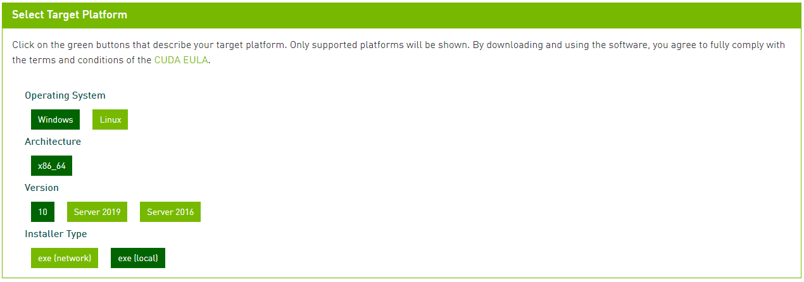
* Una vez haya finalizado la descarga, obtendremos un archivo .zip el cual se debe descomprimir para obtener el instalador
de CUDA e iniciar la instalación de NVIDIA CUDA.
* Dentro del Wizard de instalación, se debe elegir la ruta de instalación, en nuestro caso, la ruta será la que está
definida por defecto.
* Al inicializarse el instalador, se muestra una interfaz como se muestra en la figura adjunta, en ella deberá seleccionar 
el tipo de instalación Express (rápida) o Custom (perzonalizada). En nuestro caso elegimos la opción de instalación rápida  
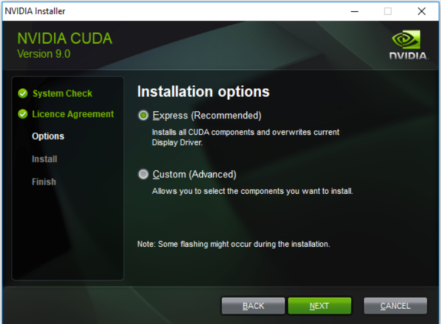
* En el siguiente apartado, es posible elegir la ruta de instalación de los diferentes componentes de CUDA, en nuestro 
caso ``C:\Program Files\NVIDIA GPU Computing Toolkit\CUDA\v11.0`` 
* En este paso, se evidencian las dependencias de Visual Studio, aunque no requiere de nuestra intervención,
ya que simplemente debemos marcar siguiente, no obstante se puede corroborar que VS forma parte del funcionamiento de 
CUDA, razón por la quno e es posible instalar CUDA sin previamente instalar una version compatible de VS.

  * Por último, se despliega la ventana de instalación final, en donde se muestran todas las dependencias y librerías que 
  se instalarán, además, en la parte izquierda de la ventana (se muestra en la figura adjunta), se puede comprobar que la 
  palabra **final** está resaltada, lo cual indica que las configuraciones establecidas han sido instaladas.
  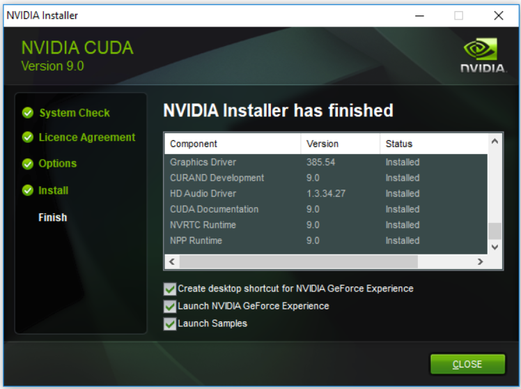
* Para comprobar la versión de CUDA instalada, puede utilizar el siguiente comando:
```buildoutcfg
nvidia-smi
```
####Nvidia cuDNN
 En cuanto a la versión de esta librería, [TF](https://www.tensorflow.org/install/gpu) recomienda utilizar la version 
 SDK 8.1.0, esta librería, nos permitirá acelerar la CNN proporcionando implementaciones altamente ajustadas para las 
 rutinas de convolución hacia adelante y hacia atrás, asi como las fases de agrupación, normalización y capas de activación.
Los pasos que seguimos para instalar esta librería se describen a continuación:
 * En primer lugar debe descargar el instalador de la librería, para lo cual es necesario registrarse en Nvidia Development y
disponer de una cuenta.
 * Al ingresar a la página de descarga con su cuenta, acepte los términos y condiciones de la comunidad y elija la 
versión compatible, en cuDNN v8.2.2 (July 6th, 2021) para CUDA 11.4 en Windows 10.
 * Como siguiente se procede a descomprimir los archivos descargados en cnDNN, los cuales se copiaran a una ruta en al
cual se ha instalado la CUDA, en nuestro caso, los archivos se copiaron en la siguiente ruta:
``C:\Program Files\NVIDIA GPU Computing Toolkit\CUDA\v11.0``
 * Por último, agregamos CUDA a las variables de entorno del sistema. Las variables de entorno que añadimos son:
   * ``C:\Program Files\NVIDIA GPU Computing Toolkit\CUDA\v11.0\bin``
   * ``C:\Program Files\NVIDIA GPU Computing Toolkit\CUDA\v11.0\libnvvp``
####Tensorflow con soporte de GPU
 Para este apartado, es muy importante haber instalado correctamente CUDA, cuDNN y además, haber agregado correctamente 
 las variables de entorno, caso contrario, la GPU no podrá ser reconocida al momento de importar la librería a un
 determinado proyecto. Asumiendo que las configuraciones anteriores se han realizado correctamente, procedemos a instalar
 la librería de TF. Para ello seguimos los siguientes pasos:

 * Mediante el Powershell Prompt de conda o símbolo del sistema de Windows (si agregó conda a las variables de entorno), 
crear un entorno virtual (Env), en el cual se instalarán todas las librerías y dependencias incluyendo tensorflow.
Utilice el siguiente comando, especificando el nombre (puede usar cualquier otro) y la versión de python, en caso de que
tenga instalada más de una versión:
    ```buildoutcfg
    conda create --name tensorflow python=3.8
    ```
 * Compruebe si el entorno fue creado, usando ``conda env list``. Este comando listará todos los entornos creados y
gestionados por conda, verifique si ``tensorflow``se encuentra en la lista
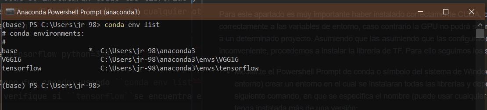
 * Una vez comprobado que el entorno se ha creado exitosamente, activamos dicho entorno usando el comando ``conda activate``
seguido del nombre del entorno, en nuestro caso ``tensorflow``
    ```buildoutcfg
    conda activate tensorflow
    ```
    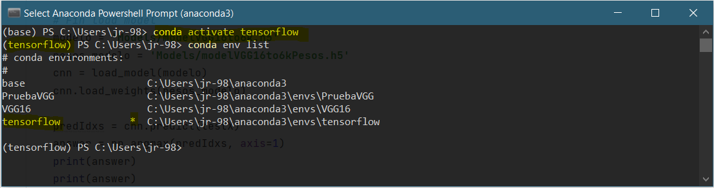   

   Nótese, que el nombre que antecede a la ruta de Powershell previo a la ejecución del comando lo antecede la palabra 
``base`` que es el entorno por defecto que activa conda. Este nombre se remplaza por el nombre del entorno que se acaba 
de activar con el comando anterior, en nuestro caso ``tensorflow``
 * Por último instalamos TensorFlow con soporte GPU, para lo cual usamos el siguiente comando, especificando el número 
de versión:
    ```buildoutcfg
    pip install tensorflow-gpu==2.4.0
    ```
 * Tras finalizar el proceso de instalación, con el siguiente comando, procedemos a comprobar la instalación de TensorFlow 
y verificar si la GPU esta habilitada y disponible para su uso. Usando el siguiente comando en la consola, comprobamos 
la disponibilidad de la GPU:
    ```buildoutcfg
    % python
    >>> import tensorflow as tf
    >>> tf.test.is_gpu_available()
    ```
    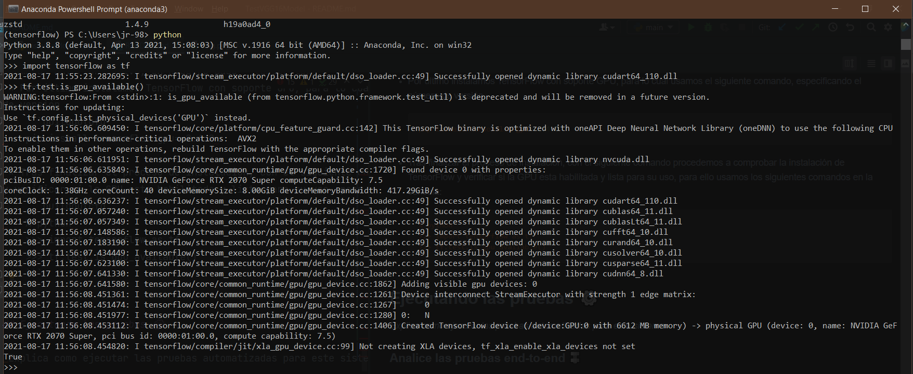
    Como se puede apreciar al la imagen adjunta, en la línea final ``True`` indica que la GPU esta habilitada para su uso. 
Como datos adicionales, tenemos el nombre de la GPU, el tipo de dispositivo y demás características referentes a la 
tarjeta gráfica.

#### Instalación de librerías adicionales
Para instalar el resto de librerías adicionales como open cv, keras, scikit-learn, jupyterlab, las cuales son necesarias 
para la ejecución del modelo usar, el siguiente comando:
```buildoutcfg
pip install -r requirements.txt
```

## Entrenamiento del modelo ⚙️

Para entrenar el modelo, se usó el IDE de PyCharm y JupyterLab como entornos de desarrollo.
Si utiliza JupiterLab bastará con activar el entorno, tal como se hizo en los pasos anteriores. 
En caso de usar PyCharm, debera abrir el proyecto desde el IDE y configurar el intérprete (en la mayoría de los casos). Para ello, siga los siguientes pasos:
* Diríjase a la pestaña ubicada en la parte inferior derecha, donde se aprecia el nombre intérprete, en nuestro caso
``Python3.9``. 
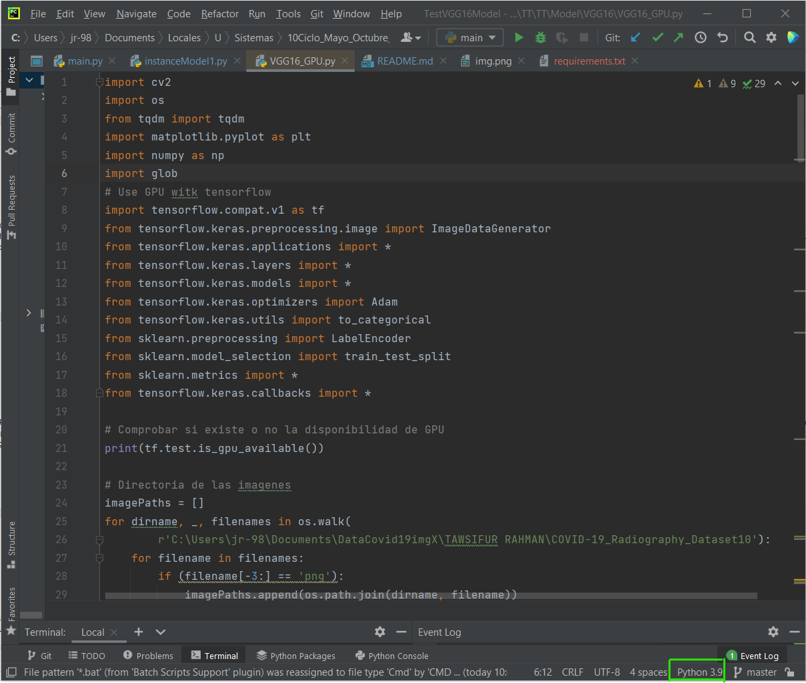
* Seleccione la opción de **Add interpreter** o **añadir interprete**.
* En el apartado, **Base interpreter** ubicar la ruta del entorno ``tensorflow`` (entorno el cual se creó para la
instalación de TF) y ubicar el archivo python. En nuestro caso la ruta es``C:\Users\user\anaconda3\envs\tensorflow\python.exe``
* Al seleccionar dicho intérprete, todas las dependencias instaladas dentro del entorno se cargarán y estarán disponibles
para su uso dentro del modelo. Además, puede verificar que el nombre del intérprete ha cambiado por el nombre del entorno 
(entre paréntesis) junto con la versión de python instalada específicamente en este entorno.
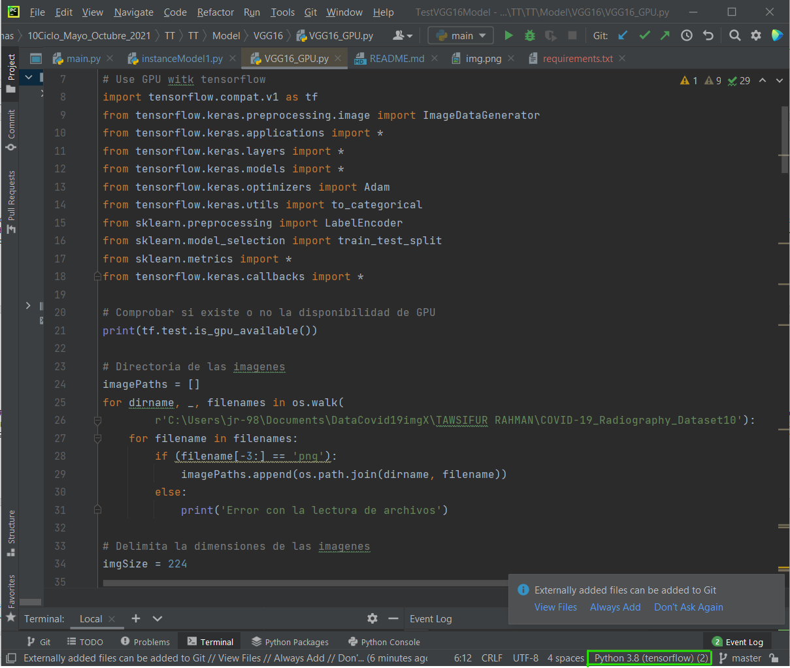

 ## Despliegue y construcción de API 📦
Para mejorar la usabilidad del modelo, se consideró la creación de una API, la cual será consumida por una interfaz 
gráfica, todo esto, con el fin de agilizar el proceso de evaluación del modelo, y además mejorar la experiencia de uso por 
parte de los posibles usuarios finales (internos de medicina y radiólogos expertos que deseen cotejar sus diagnósticos).

La API Rest en cuestión, fue creada usando [FastApi](https://fastapi.tiangolo.com/), 
la cual, mediante un método GET, recibe la dirección de la imagen que será cargada de forma local mediante la interfaz
y luego subida a un repositorio de imágenes llamado cloudinary. Este método por tanto permitirá subir una imagene y a la 
vez obtener toda la información referente a esa imagen mediante una petición de consulta, la cual a su vez, hará uso de
una función que haga uso del modelo y este a su vez retorna como respuesta el valor de la predicción, tal como se 
muestra en la figura adjunta.
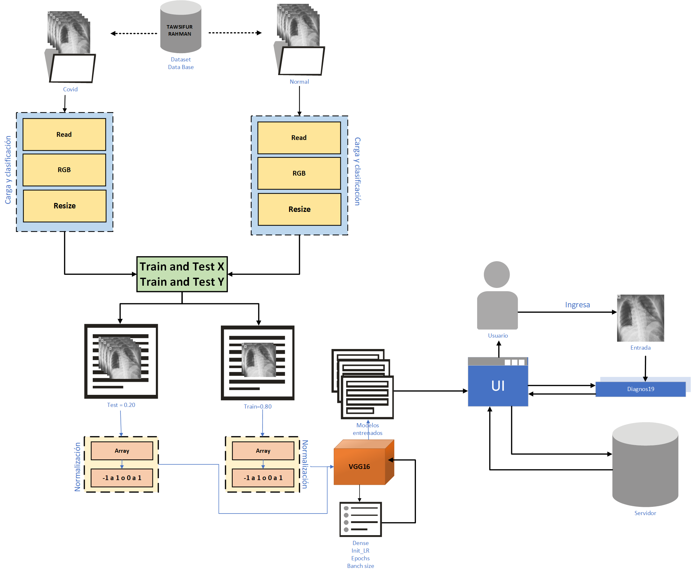
Todo el esquema anterior se ha desplegado usando como base un proceso similar al utilizado en la fase de entrenamiento y
validación del modelo, es decir, como primer, paso tenemos la entrada de datos, con la diferencia que ente caso se 
realizará una entrada a la vez. Seguidamente se realizará la transformación de la imagen entrante a tensores, los cuales 
serán evaluados por el modelo resultante. Por último, se cargará tanto el modelo como sus respectivos pesos, para 
realizar la clasificación (diagnóstico) de la imagen entrante. El resultado de la predicción será enviado como respuesta 
de la petición realizada con el método post del API.
El despliegue de la API, y su integración en la UI, ha sido basada en la documentación oficial de [FastApi](https://fastapi.tiangolo.com/es/deployment/deta/) 
Para levantar el servicio se utilizó:
```buildoutcfg
uvicorn main:app --reload
```
Luego de haber desplegado la API usamos la siguiente dirección por defecto ``http://127.0.0.1:8000`` para acceder a la
UI de fastApi y poder comprobar la funcionalidad de la petición. Para ello accedemos a ``http://127.0.0.1:8000/docs``, 
con lo cual se despliega la siguiente IU:
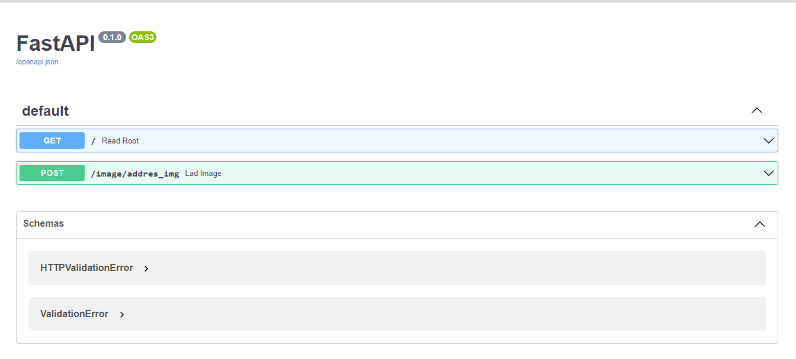
El método debemos comprobar será el método POST ``/image/addres_img Load Image``, el cual solicita como parámetro la ruta
de la radiografía a diagnosticar. Para ingresar dicho parámetro y comprobar la respuesta que el modelo arroja accedemos 
al método y seleccionamos la opción ```Try it
out```, tal como se muestra a continuación:
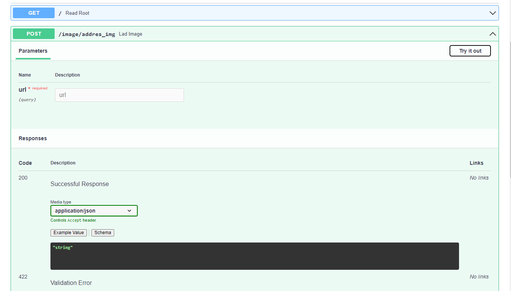
Como atributo de ```ruta``` que el método post solicita debe utilizar la ruta de imagen, en nuestro caso, la ruta será
la URL de la imagen que se encuentra alojada en el servicio de Cloudinary, véase [Diagnos19](https://github.com/jr-98/Diagnos16),
donde se presenta el desarrollo de la UI y se explica el servicio de Cloudinary. 
No obstante, a continuación, se presenta el resultado de la API al diagnosticar una radiografía, tal como se muestra en
las figuras adjuntas, el método devuelve un valor (0=Covid y 1= Normal), dicho sea de paso, la ruta enviada para la 
verificación del método se trata de una imagen con ```normal```, por lo que el valor de respuesta de la 
API es ``{"valor":1}``.

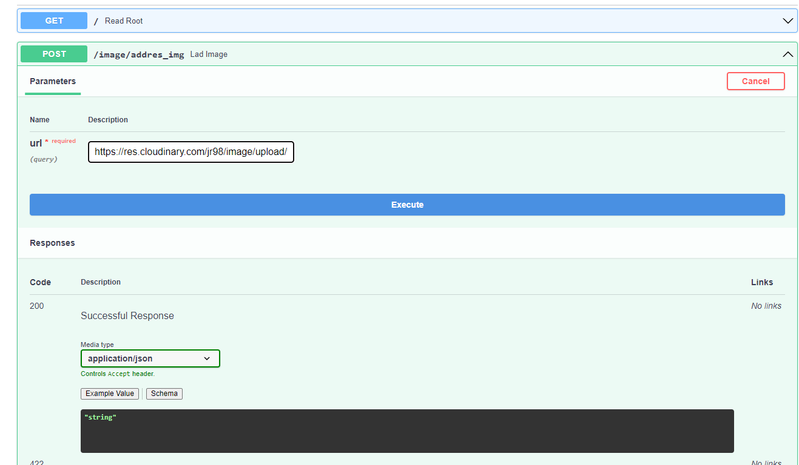
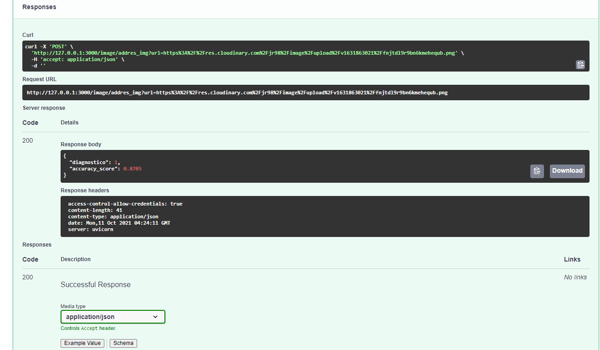
Ademas, estos valores se contratan con los resultados arrojados por el modelo en la consola de PyCharm (IDE utilizado), 
la cual se presenta en la imagen adjunta:
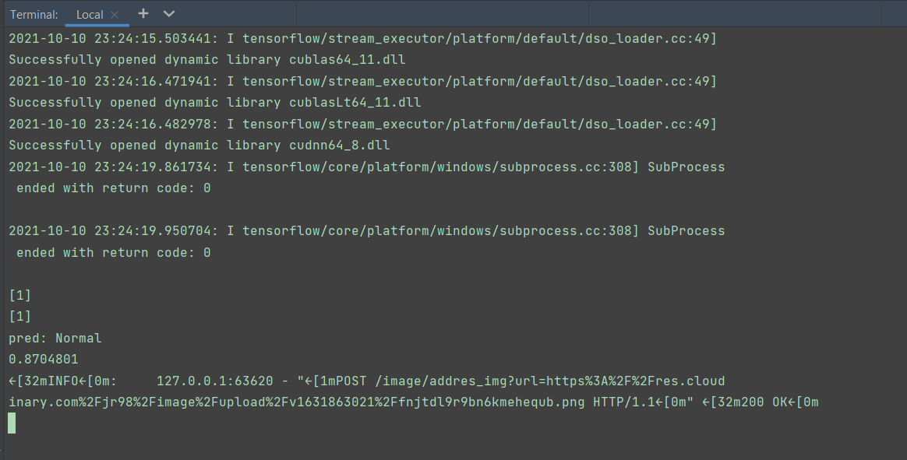
## Construido con 🛠️
* [Python](https://www.python.org/) - Lenguaje de programación de alto nivel, utilizado para el desarrollo de modelo de 
IA debido a la gran cantidad de librerías, documentación y soporte.  
* [TensorFlow](https://www.tensorflow.org/) - Librería Open Source, utilizada para el desarrollo y entrenamiento de 
modelos de ML. 
* [Django](https://www.djangoproject.com/) - Framework Open Source basado en Python, para la construcción rápida y eficiente de 
aplicaciones y servicios web.  
* [FastApi](https://fastapi.tiangolo.com/) - Usado para generar generar y desplegar la API que permite la utilización 
del modelo
* [Github](https://github.com/)- Repositorio usado para el alojar el código y material concerniente al presente TT.

⌨ [jr-98](https://github.com/jr-98)